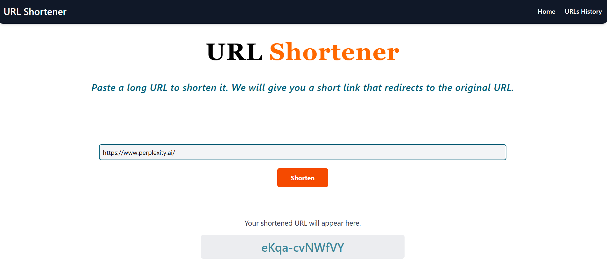

# 🔗 URL Shortener

> A simple and responsive URL Shortener Web App that allows users to generate shortened links instantly and track their usage.

## 📖 Table of Contents
- [About the Project](#-about-the-project)
- [Features](#-features)
- [Tech Stack](#-tech-stack)
- [Screenshots](#-screenshots)

---

## 📌 About the Project
This project is a **URL Shortener Web App** with a clean and user-friendly interface.

- The **Homepage** features a navigation bar with links to **Home** and **URL's History**.  
- On the homepage, users can paste a long URL into an input box and click **Submit** to instantly generate a shortened link.  
- The shortened link is displayed right below the submit button for quick access.  

The **URL's History** page contains:
- A styled table showing:
  - **Short URL** (clickable, redirects to the original URL)  
  - **Redirect URL** (full original link)  
  - **Visited** (number of times the short link has been clicked)  

---

## ✨ Features
- 🔹 Instant URL shortening  
- 🔹 Clickable short links redirect to original URLs  
- 🔹 Track the number of visits for each link  
- 🔹 Responsive design for desktop and mobile  
- 🔹 Organized URL history in a styled table  

---

## 🛠 Tech Stack
**Frontend:** HTML, CSS, JavaScript  
**Backend:** NodeJS, ExpressJS  
**Database:** MongoDB  
**Other Tools:** Git, GitHub, Tailwind CSS

---

## 📸 Screenshots  

### 🏠 Home Page  
A clean and minimal interface with a navigation bar and URL input box for shortening links.  
  

---

### 🔗 URL Shortening in Action  
Instantly generates a short link after submitting a long URL.  
  

---

### 📜 URL History Page  
Displays a styled table with all previously shortened URLs, their redirect destinations, and visit counts.  
  

---

### ✨ Clickable Short URLs  
Clicking on a short URL redirects to the original link.  
  

---

### ⏱ Visit History with Timestamp  
Track when each shortened link was accessed with date and time.  
  

